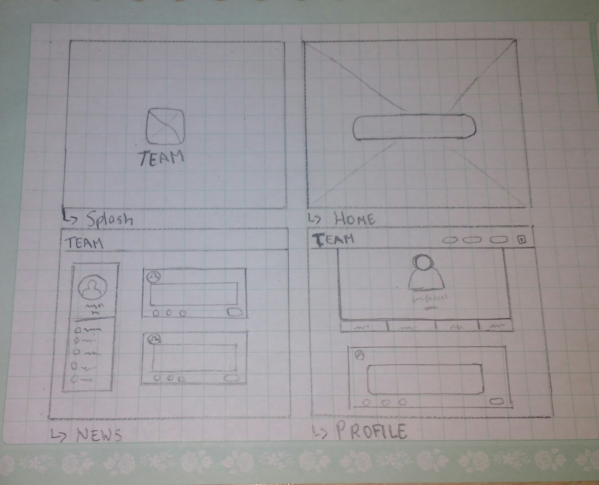

# **Nuestra Red Social**
* **Unidad5:** _CREA TU PROPIA RED SOCIAL_

***
## Objetivos

El objetivo es crear una red social que tenga en cuenta algunos puntos básicos que debe tener una red social, los cuales son:

+ Perfiles de usuarios.
+ Un lugar donde poder escribir posts.
+ Un newsfeed donde puedes ver las actualizaciones de todos tus contactos.
+ Un lugar para subir fotos.
+ Capacidad para poder tener amigos y seguir a personas y marcas.
+ Ser mobile friendly, etc.

## Flujo de la aplicación

## Scketch

## Planificación

Se dividió el trabajo en etapas, las cuales se detallaron así:

- En la primera etapa se definió el diseño UX y el UI de la red social, se tomó en cuenta los puntos principales de una red social.

- En la segunda etapa se definió el framework a utilizar y las tareas de cada integrante.

- La tercera etapa consistió en realizar el producto final en sí, con todas las herramientas aprendidas en el Bootcamp.

## Observaciones

- Se utilizó Firebase para realizar la autenticación del usuario mediante el acceso de Google.

## webSite

* Aquí puedes visualizar el proyecto 

(https://angelicavc21.github.io/red-social-YaniraAngelica/)

## Desarrollado con:

`HTML5` `Jquery` `CSS3` `Materialize` `Firebase`

***
## Colaboradoras
* Yanira Arenazas 
* Angelica Villalobos
